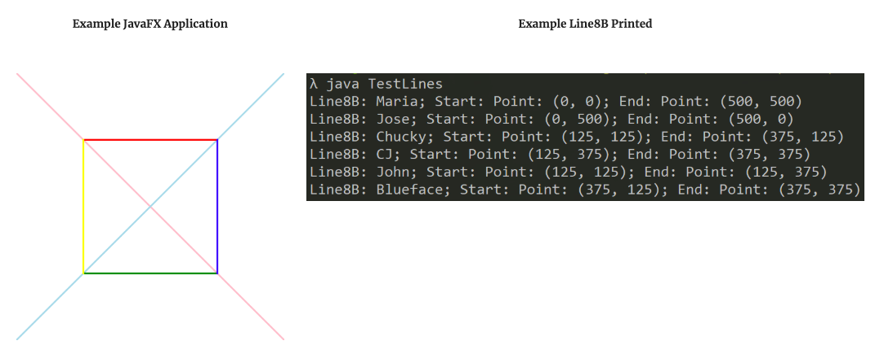

# PSA 5: Recursion + Recursive Shapes  
This PSA is due November 20, Wednesday, 11:59pm

## Introduction
In this assignment, we will use the idea of recursion to draw fantastic shapes in Java!

The images below show one of the shapes you will be creating using recursion and the Fibonacci sequence! This is the golden ratio, often held as the "perfect" standard of beauty among other things.


## Starter Code
Copy the starter code using the same command cp -r as in the previous PSAs (refer to PSA 0 if you need a refresher). The starter code is located at the following path:
```
~/../public/psa5
```
Backup your code as you progress through the assignment. Submit to Gradescope as a backup!

## Part 1: Warm Up Recursive Exercises
In this section, we will go over some basic exercises to get you more comfortable with using recursion (before we get to the really fun stuff)!

Recursion is a common practice in the field of Computer Science. Recursive functions make recursive calls to itself in the method body. You can write the same method both iteratively and recursively. Below is the general format of a recursive function. **Keep in mind this structure does not work for all recursive functions.**

The main takeaway is that you need **a base case and a recursive case**. The recursive case should contain a recursive call to the method with a different parameter than what was passed originally.
```java
recursive_method(input) {
     //base case
     if ( ___ ) {
         //terminate the method
     }
     //recursive case
     _______ <do some optional action>
     recursive_method(altered_input) // call method again
     _______ <do more recursion or clean up>
}
```
In this warm-up section, you are asked to write two recursive functions .

**Remember, the following methods must be implemented recursively, NOT iteratively.** In other words, do **NOT use for loops** for the following methods. You will not get any credit if you implemented your solutions via iterative ways. **You are not allowed to use static or instance variables for the two following methods**.

Please implement the following two methods in `Exercise.java`.

### sumList()
```java
public static Integer sumList(ArrayList<Integer> list)
```
This method calculates the sum of all Integer values in a given ArrayList. 

For example, if `ArrayList<Integer> list` contains {1, 2, 3}, a call to `sumList(list)` should return 1+2+3, which is 6 as an Integer. 

* Return 0 if the list is empty or null. 
* Think about the base case.
    * When should the method terminate/end?
    * Under what condition should your method stop making recursive calls and return your expected value?
* Think about the recursive case. 
    * Make recursive calls to the method; make sure to call sumList in the method body.
        * How would the input have to change in the recursive call? What should your parameter argument be?
        * Keep in mind, you do not need to keep the original ArrayList content.
* Again, iterative solution will not be accepted; do NOT use loop to solve this problem.

### strToList()
```java
public static ArrayList<Character> strToList(String word)
```
This method transforms a `String` into an `ArrayList<Character>` containing each character of the string in order. 

For example, `strToList("word")` will return an `ArrayList<Character>` of four characters: `{w,o,r,d}` .

`strToList("hello CSE8B")` will return an `ArrayList<Character>`: `{h,e,l,l,o, ,C,S,E,8,B}`

* Return an empty list if the string is empty. 
* Return null if the string is null
* Think about base case.
    * When should the method terminate/end?
    * Under what condition should your method stop making recursive calls and return your expected value?
* Think about the recursive case
    * Make recursive calls to the method; make sure to call `strToList`
        * How would the input have to change in the recursive call? 
        * Keep in mind, you do not need to keep the original ArrayList content. 
* An iterative solution will not be accepted.

You should have a basic understanding of how recursion works now! The main PA will have more fun and challenges!

## Part 2: Code Review
In this portion of the assignment, we will focus on an aspect of software engineering that every programmer has to face: Code Review. In industry, making changes to the code base usually requires at least two or three other engineers to have reviewed your code and ensured its quality. Reviewing other peoples code is not only a way to make sure that all finalized code is up to standards, it is also a good way to expose yourself to the kind of work someone else writes and passively leads to a higher quality in your own code.

In total, there are 10 different versions of this file. We have randomly assigned you two files, but you need only review one of the two. You must review one of the versions we assign to you. You can find version assignments [here](https://docs.google.com/document/d/1YhQ7EpNVLXKU7cfrrsR0laSMuUnLOMWkFq_RqDyhrfc/edit) indexed by your cs8bfa19 login.

### Your Task:
**First**, create a section in your `README.md` called "Code Review - CodeZ.java", where CodeZ.java is replaced with whichever file you are reviewing (e.g. CodeJ.java).

**Next**, create three subsections, "What is good about this code", "Logic and functionality errors" and "Miscellaneous comments".

The format of each section should just be in bullet points. Write enough that we can know what you're talking about but don't write so much that we don't want to read it. **We don't expect you to find every single error.**

**Part 1: What is good with this code.** You should write what this code is good about. For example, the programmer handled the normal case with good style, considered edge cases such as null reference, etc.

**Part 2: Logic and functionality errors:** For each error in functionality, note it down in a bullet point in the first section; write a high-level description, e.g. "The code fails to handle the case of ____ input: It should do ____ but instead does ____." You might find it helpful to make changes to the code and add test cases in a tester main, feel free to do this, just make sure that anything you note down as wrong is from the original code and not your added code (maybe open the original copy in a read-only tab of vim). You don't need to fix or add any additional styling to this code; we will not require you to turn in a fixed CodeZ.java file.

**Part 3: Miscellaneous comments:** We want you to write about any sort of styling or other "errors" you run into. Don't worry about the file header, but anything else from the style guidelines are valid things to write about. This could be anything from formatting inconsistencies to blatant violations of the guidelines. **Hint**: One easy thing to write about might be the inline comments (describe if they are not useful and why).

### The Code
The file has just one method called `maxAlternating()` with the following method header:
```java
public static int maxAlternating(int[] array)
```

This method takes one integer array and returns the **length** of the longest alternating sequence in the array.

An alternating sequence is a sequence of 3 or more numbers where the even indexes all share the same value and a different value is shared by all the odd indexes.

The following are some of the expected input/output sequences:
```
[2,1,2,2,2] --> 3
[2,1,2,5,2,5,9] --> 4 (note that it does not take the length 3 sequence 212)
[1,4,7,3,9,6] --> 0
[4,4,4,4,4] --> 0
[1,5] --> 0
[1] --> 0
[] --> 0
null --> 0
```
## Part3: Shapes 

**Make sure you are using Java 10 or lower.**

In this PSA, we are using a graphics library called JavaFX.

If you are working in the lab computer or SSHing, you will be fine. However, if you are using your local machine and you have Java 11 or above, JavaFX will not be supported.

You can check your version of Java by running this command in your terminal:
```
java -version
```
If you do not have Java 10 or lower, please refer to the guide below.

If you are using the lab computer or SSHing, the following guide is unnecessary.

### Running JavaFX with Java 11

To get Java 11 to run with JavaFX, you'll need to first install JavaFX 11 Standalone for your appropriate system.

* [Download](https://gluonhq.com/products/javafx/)

Here you will click the link at the top of the web page and download the **product** based on your platform (OS) and select the SDK version.

Then follow the [Instructions](https://openjfx.io/openjfx-docs/#install-javafx) where you unzip that file to your desired location and add it to your path by following the instructions for your OS.

Notice that now, when you want to compile and run your code, you will have 2 more options that you will feed in to your command.
```
javac --module-path $PATH_TO_FX --add-modules=javafx.controls <YOUR FILENAME HERE>.java

java --module-path $PATH_TO_FX --add-modules=javafx.controls <YOUR FILENAME>
```

Also note that the way for accessing your PATH_TO_FX will differ based on your OS (`$PATH_TO_FX` for mac/linux and `%PATH_TO_FX%` for Windows)

## Introducing the Components of Shapes


**Point.java and Line8B.java are provided files, you should NOT edit or change them.**

**If your code doesn’t compile, DO NOT alter these files to try to get it to compile.**

**These files are provided for you to use to implement your other shapes. Assume they are implemented correctly.**

### Introducing Point
Open `Point.java` and take a look at what we provided. Notice a few things that will help with your own tasks:

1. No imports needed. This is because a Point is simply two ints, and we can do stuff with pairs of ints.
1. The field variables are private.
1. The second constructor defines how to instantiate a new Point using some specified coordinates. The first constructor is simply a special case of the second constructor (this is the no-arg constructor). The third constructor provides a different way to create a new Point object. This constructor is a **deep copier** (recall that ints are primitive types so they cannot be shallow copied. This is true, mainly in Java).
1. The _getters_ for the field variables.
1. The _setters_ for the field variables.
1. The `toString()` method defines how each Point object is **represented** when you call `System.out.println()` and pass the Point object reference as an argument. You may have noticed this in previous PSAs.

### Introducing Line8B
How much information do we need to define a line? Not much: we need only two points, then we can draw a line.

Open `Line8B.java` and take a look at the provided code again:

1. Imports needed: `javafx.scene.*`
1. Extends Shape (which you will write)
1. The field variables are, again, private.
1. For the constructors, note how the Point class is used to define a Line8B. A name argument can be passed into the constructor, but if no name was passed in then the shape’s name is “NoName”. Notice the call to super in the constructor. While Polymorphism is not the focus of this PSA, it is helpful to note the relationship between the classes you are writing. You will be writing the abstract superclass Shape soon.
   * Note how we are making **deep copies** of every object passed in and using our setters. The way we use Point in Line8B, you will be using Line8B in the other shape files you will need to write for this PSA.
1. Notice the _getters_ for our private instance variables. We want users to only grab values of field variables after the creation of the object.
1. Notice the _setters_ for our private instance variables. We are simply pointing the instance variable to the object that was passed in. This is possible because we made deep copies already in our constructor.
1. Read the `draw()` method. Notice it declares and instantiates a new Line, it is documented as follows:
    1. https://docs.oracle.com/javase/10/docs/api/javafx/scene/shape/Line.html
    1. Look at the Javadocs for Line, and see how it matches up with our call.
1. Notice the `toString()` method.

Essentially, our Line8B class is simply a **wrapper interface** that defines how we want the Line to draw using our own class names and parameters. We define our own classes and method signatures because we want to call functions our own way. At the same time, we don’t want to reimplement the actual logic for graphical drawing because the JavaFX library already did it.

**Do not compile yet.**

It won’t work because you have not implemented Shape yet. That will be our first task.

## Shape: an Abstract Class for an Abstract Idea

### Implement the Shape class

Shape is an abstract class so Shape objects cannot be instantiated. All Shapes must have a name in order to identify the name of the shape being drawn, where the name of the Shape is stored in a `private String` variable called `shapeName`.

You are implementing the Shape class from scratch, as well as the classes in Concrete Shapes (next page). Create a new file called **`Shape.java`** and import the following libraries after your well-commented file header:
```
import javafx.scene.*;
import javafx.scene.paint.*;
import javafx.scene.shape.*;

import java.util.*;
```

### Basic Structure
Because you are implementing this class from scratch, there are no provided method headers in this section.

1. Define the **`public abstract class`** named **`Shape`**.
1. This class contains one instance variable: `shapeName`, a private String that identifies the name of the Shape.

#### Two Constructors:
1. The first constructor takes one argument, a String. Assign this argument to the instance variable `shapeName`.
1. The second constructor is for the case that we don’t have a name to give the shape. In this case, this is a **no-parameter** constructor. It simply calls the first constructor, passing in “NoName” as the parameter.

#### Getters:
Since the field variable name is called shapeName, the getter is named **`getShapeName()`**. It should be public to allow users to obtain the name of the shape. You will use this method to access the name of the shape.

#### Setters:
The setter is named `setShapeName()` and `public` to allow users to change the name of the shape. It takes in a String that will be the new name of the shape and returns nothing.

### Methods
#### draw()
Declare a public abstract method named **draw** with the parameters `Group group`, `Color c`, and `boolean fill` in this order, returning nothing (`void`).

1. Because this is an **abstract method**, you do not need a method body! You will override this method in later classes that extend the Shape class.
1. Don’t worry about the Group and Color classes yet, they are from the JavaFX Scene class, which are already imported by your libraries. They represent the canvas to draw on, the color of the Shape, and whether the Shape should be filled or not.

#### toString()
This is a `public` method that returns a String representing the name of the shape and takes no parameter. It should call your getter for the name of the shape. You will use this method in your concrete classes.

#### getRandomColor()
**This method is provided and you do not need to modify it (see below).** This is a public method returning a random Color from the JavaFX Color class ([documentation](https://docs.oracle.com/javase/10/docs/api/javafx/scene/paint/Color.html)). The `nextDouble()` method in the Random class returns a value between 0 and 1, which is what the Color constructor takes as arguments for its Red/Green/Blue values. Note that the last argument of the constructor, a `1`, denotes the opacity/transparency of the color.
```java
public static Color getRandomColor()
{
Random random = new Random();
double r = random.nextDouble(),
g = random.nextDouble(),
b = random.nextDouble();
return new Color(r, g, b, 1); // Color constructor
}
```
### Test the Shape

On Gradescope, we will have TestPrototype check if your field variable permissions, field names, parameter types are correct. We will also have TestSanity which will test your toString()s.

#### Upload Shape.java to Gradescope to check your file before working on the following files.

Now you can try compiling Line8B.java. If your Shape class is implemented correctly, then there should be no errors. If there are errors, remember **NOT to edit Line8B**. The error is not in Line8B, but in your Shape class. Debug your Shape class.

Line8B is not submitted, and no changes to Line8B are considered.

Compile and run:
```java
javac TestLines.java
java TestLines
```

#### Some Test Cases

This is not an exhaustive list, so you should definitely test for more!

1. Check how the line is drawn by calling Line8B’s `draw()` method.
1. Print the reference of Line8B object. See if you get the three lines of information or a reference number.
1. Print the String returned by the inherited `Line8B.getShapeName()`.
  


## Concrete Shapes

**Do not add instance variables to the classes except for the ones explicitly mentioned by the spec. Magic number constants (i.e. private static final) are expected.**

If you find any discrepancies in the write-up, diagram, or starter code, please make a post on Piazza. This is a detail-heavy assignment, so we want to clear up any inconsistencies as early as possible!

### JavaFX
JavaFX is a GUI library full of fun things to play around with, such as shapes, animations, and text.

For this assignment, you will be asked to make method calls to the JavaFX library. You do not need to go too in depth with JavaFX, as we will not be asking you to build any complex GUI using JavaFX.

We are mainly using JavaFX to easily create shapes in your draw() methods.

**Useful Documentation**:

* Color: https://docs.oracle.com/javase/10/docs/api/javafx/scene/paint/Color.html
* Shape: https://docs.oracle.com/javase/10/docs/api/javafx/scene/shape/Shape.html
* Circle: https://docs.oracle.com/javase/10/docs/api/javafx/scene/shape/Circle.html
* Rectangle: https://docs.oracle.com/javase/10/docs/api/javafx/scene/shape/Rectangle.html
* Polygon: https://docs.oracle.com/javase/10/docs/api/javafx/scene/shape/Polygon.html
* Group: https://docs.oracle.com/javase/10/docs/api/javafx/scene/Group.html

### Basic Shapes
Here's a diagram of all the shapes you have been given and have to implement, creating your own files from scratch.


### Shape, Point and Line8B classes
These three classes are provided to you as other classes (Circle8B, Square, Triangle, and Fibonacci) all rely on these two classes one way or the other. You may borrow some ideas on how to implement your own classes from the sample classes we have provided. **So make sure you carefully examine the provided class files before moving on to implement other classes.** Note that Shape is an abstract class.

### Circle8B
A Circle8B is defined by a Point and an int. The Point represents the coordinates of the circle’s center and the int represents the radius of the circle. Since Circle8B extends Shape, it will also implicitly inherit its name.

1. Implement the public getters for the radius and center instance variables.
    * `getCenter()`, `getRadius()`
1. Implement **private** setters for each point. These do not return anything and are shallow, meaning that you will simply point the corresponding instance variable to the object/value passed into the method. See Line8B and Point for an example.
    * `setCenter(Point center)`, `setRadius(int radius)`
1. Implement five constructors with the following parameters. Make sure to use **deep copy**! If a name is not given, a Circle8B should have the default name `“NoName”`, even in the deep-copy constructor (hint: what does the Shape constructor do?). You should use the setters you just wrote in these constructors rather than directly assigning values to your instance variables. For this class and other classes, try to reuse some constructors when implementing other constructors so you won't be repeating the same lines of code. See `Line8B.java` for an example.
    * Point center, int radius
    * Point center, int radius, String name
    * Circle8B c
    * Circle8B c, String name
    * (none) -- Default center is at (0,0) and default radius is 0
1. Implement the `public String toString()`

    * Desired output format:
    ```
    Circle: <Name>; Center: Point: (<x>, <y>); Radius: <Radius>
    ```
    Make use of `toString()` implemented in the Shape and Point classes. For example, if a Circle’s name is “Paul” with radius of 100 and center at (50, 50), the result of `toString()` is:
    ```
    Circle: Paul; Center: Point: (50, 50); Radius: 100
    ```
1. Implement the `draw()` method.

    * As it turns out, drawing the Circle8B has already been implemented in the JavaFX library, so we just need to invoke the correct methods. Again, take a look at the documentation for the Circle class. All you need to do is call the constructor you found, change its color, and add the Circle object to the group.
    * The parameters for our Circle8B.draw() is different from the parameters of the Circle object! You need to convert our information (coordinate of center point, radius) into information the constructor expects (x, y, radius, color).
    * Make sure that the fill parameter will cause the function to choose the appropriate JavaFX class to instantiate. If fill is false, make the fill of the shape empty by passing in null to the appropriate method and set the stroke outline to the color passed in. (Hint: see Color documentation)
6. Test the class before moving on. Refer to `TestLines.java` on how Line8B was tested.

### Square
A Square is defined by a Point and an int. The Point represents the coordinates of the square’s upper-left corner. The int represents the length of the sides. Since Square extends Shape, it will also implicitly inherit the name.

1. Implement the public getters for the side length and upperLeft Point instance variables:
    * `getSide()`, `getUpperLeft()`
1. Implement private setters for the upper left point and side length. These do not return anything and are shallow, meaning that you will simply point the corresponding instance variable to the object/value passed into the method. See Line8B and Point for an example.
    * `setUpperLeft(Point upperLeft)`, `setSide(int side)`
1. Implement four constructors with the following parameters. As with Circle8B, if not given, assign the default name “NoName”. You should use the setters you just wrote in these constructors rather than directly assigning values to your instance variables. Remember to use deep copy! See Line8B if you need a hint.
    * Point upperLeft, int side
    * Point upperLeft, int side, String name
    * Square square
    * (none)-- Default upper left corner is at (0,0) and default side length is 0
1. Implement `public String toString()`:
    ```
    Square: <Name>; upperLeft: Point: (<x>, <y>); side: <sidelength>
    ```
    Make use of toString() from the Shape and Point classes to implement this method. For example, if we have a Square named “Gary” with side length of 9 at (10,10):
    ```
    Square: Gary; upperLeft: Point: (10, 10); side: 9
    ```
1. Implement the `draw()` method.
    * (Similar to Circle) As it turns out, drawing the Square has already been implemented in the JavaFX library, we just need to invoke the right methods. Again, take a look at the [documentation](https://docs.oracle.com/javase/10/docs/api/javafx/scene/shape/Rectangle.html) for the Rectangle class. All you need to do is call the constructor, change its color, and add the Rectangle object to the group.
    * The parameters for our `Square.draw()` is different from the parameters of the Rectangle object! You need to convert our information (`coordinate of upper left, side length`) into information the constructor expects (`x, y, width, height`).
    * Make sure that the `fill` parameter will cause the function to choose the appropriate JavaFX class to instantiate. If `fill` is false, make the fill of the shape empty by passing in `null` to the appropriate method and set the stroke outline to the color passed in. (Hint: see [Color documentation](https://docs.oracle.com/javase/10/docs/api/javafx/scene/paint/Color.html))
1. Test the class before moving on. Refer to `TestLines.java` on how Line8B was tested.

### Triangle
It turns out that the JavaFX library does not implement their own version of Triangle, so we will have to implement our own!

A Triangle is simply three Points. Using those three Points, we can draw a triangle frame using JavaFX's Polygon class. Thus, the Triangle is a class that extends Shape and contains three private Points named p1, p2, and p3.

1. Implement public getters for each point: `getP1()`, `getP2()`, `getP3()`
1. Implement private setters for each point. These do not return anything and are shallow, meaning that you will simply point the corresponding instance variable to the object/value passed into the method. See Line8B and Point for an example.
    * `setP1(Point p1)`, `setP2(Point p2)`, `setP3(Point p3)`
1. It has four constructors whose parameters types are the following. As with Circle8B, if not given, assign the default name “NoName”. You should use the setters you just wrote in these constructors rather than directly assigning values to your instance variables. Remember to use deep copy! See Line8B if you need a hint.
    * Point p1, Point p2, Point p3
    * Point p1, Point p2, Point p3, String name
    * Triangle tri
    * (none) - no arg constructor sets all points to (0,0)
1. Implement `public String toString()`:
    ```
    Triangle: <Name>; p1: Point: (<x>, <y>); p2: Point: (<x>, <y>); p3: Point: (<x>, <y>)
    ```
    For example, if we have a triangle named “Rick”, with vertices at (0,0), (3,0), (4,0), toString() would print:
    ```
    Triangle: Rick; p1: Point: (0, 0); p2: Point: (3, 0); p3: Point: (4, 0)
    ```
1. Implement the `draw()` method.
    * Create a Polygon ([documentation](https://docs.oracle.com/javase/10/docs/api/javafx/scene/shape/Polygon.html)) whose three vertices are at each point of the calling Triangle object. All you need to do is call the constructor, change its color, and add the Polygon object to the group.
    * The parameters for our `Triangle.draw()` is different from the parameters of the Polygon object! You need to convert our information (`coordinates of points`) into information the constructor expects (`array of doubles corresponding to the x and y values of each point in order`). For example, for a Triangle with points (0, 1), (2, 3), and (4, 5), the array would be in the order of 0, 1, 2, 3, 4, 5.
    * Make sure that the `fill` parameter will cause the function to choose the appropriate JavaFX class to instantiate. If `fill` is false, make the fill of the shape empty by passing in `null` to the appropriate method and set the stroke outline to the color passed in. (Hint: see [Color documentation](https://docs.oracle.com/javase/10/docs/api/javafx/scene/paint/Color.html))

### Mickey and Piet Mondrian
We provided two additional programs to run your basic shapes, **TestMickey.java** and **Test[PietMondrian](https://en.wikipedia.org/wiki/Piet_Mondrian).java**. Compile and run these programs as you would run a typical Java program.

These test files use your implementation of Shape, Circle, Square, etc. to create the images below.

Do not compile or run `TestSpecialShapes.java` yet -- that's for the next section!


## Fancy Shapes 
**Do not add instance variables to the classes except for the ones explicitly mentioned by the spec. Magic number constants (i.e. private static final) are fine and encouraged.**

We will derive extra information we need within the new function we write for each class. Use private helper methods to think through the progression of logic.

Simple shapes are too simple for you smart cookies, let’s raise our standards! For each shape, use recursion to upgrade the `draw()` functionality for each subclass Circle, Triangle, and Square. We will progress from simple recursion to slightly tougher recursion. The concept of recursion remains the same, but our use of it will increase in complexity. If recursion is not used, there will be no credit awarded.

### Bull’s Eye
We will draw a multi-colored bullseye by using the Circle class.
```java
public void drawBullsEye(Group group, boolean fill, int n)
```
A few things to notice about this signature: the color is not a parameter, but `n` is. The color of the circles will be random. The parameter `n` tells how many circles we want to draw for this particular instance of the fancy shape.

As you know, the Circle is defined by its `radius` and `center`. For our initial step, we will draw the circle as we usually do by calling `draw()`. The arguments `group` and `fill` will simply be passed from the parameters of drawBullsEye(). Generate a new random color (see Shape class for a hint) and make a call to `draw()`.

#### Terminating Case (Base case)
If `n == 0`, return without doing anything.

#### Recursive Case
**You may assume the argument n will never be a negative number.** This argument says how many circles to create. If `n==0` from the start, then no circles should be drawn. If `n==1`, then only one circle will drawn.

After drawing the circle, if the current n is greater than 0, then we recurse by doing another method call. First, we need to set up the next circle. Let the center stay the same, but decrease the radius by 13. Then call `drawBullsEye()` with the same arguments, except decrement n by one.

### Triforce
We will draw a Triforce via the Triangle class.
```java
public void drawTriforce(Group group, boolean fill, int n)
```
The triforce is simply a triangle that contains an inner triangle whose vertices are at the midpoint of the sides belonging to the outer triangle.

#### Inner Triangle’s Three Points
The color of the triangles will be random, and the parameter n tells how many triangles we want to draw for this particular instance of the fancy shape.

Recall that Triangles are made of three Points, based on our class definition of a Triangle. Find the **three midpoints** between the outer triangle’s three Points. These three midpoints will become the Points of the inner Triangle. You may want to use a private helper method to find these midpoints.

#### Terminating Case (Base case)
If `n==0`, return without drawing any Triangles.

#### Recursion
As usual, there are only three parameters: the `group`, the `fill`, and `n` (a non-negative input that tells how many Triangles to draw; you may assume this will never be a negative number). The color of each triangle will be random - generate a new random color (see Shape class for a hint) and make a call to `draw()`.

For reference, if `n==1`, draw a single triangle.

### Grid (good enough to be modern art)
We will draw a nice piece of modern art by using the Square class.
```java
public void drawGrid(Group group, boolean fill, int n)
```
#### Terminating Case (Base Case)
If `n == 0`, return without drawing any squares.

#### Initial Case
The color of the squares will be random, and the parameter n tells how many squares we want to draw for this particular instance of the fancy shape.

As you know, the Square is defined by its side and upper left point. For our initial step, we will draw the square as we usually do by calling `draw()`. The arguments `group` and `fill` will be passed simply from the parameters of `drawGrid()`. Generate a new random color (see Shape class for a hint) and make a call to `draw()`.

#### Recursion
The recursion for this portion is slightly more complicated. In the drawBullsEye and drawTriforce methods, the recursion was linear: if n = 3, then we recursed three times because it drew three shapes embedded within each other. In other words, each method called itself only once. Here, we will have the method call itself **four times** for each `n`. That is, there should be four calls to `drawGrid()` in `drawGrid()` itself.

In the colorful grid picture on the top of this page, `n` is 4. If `n == 1`, then one square is drawn. If `n == 2`, then five squares are drawn. A new square is drawn at each vertex (corner) of root square. If `n == 3`, then 21 squares will be drawn (1 + 4 + 16).

However, some squares will be drawn over pre-existing squares! Since the recursive case is to always draw another square at the vertex of the original square, when `n == 3`, the original first square gets drawn-over four times and the darker blue squares below get drawn-over once. This is why `n == 3` looks like it has only 13 squares, rather than 21.


### TestSpecialShapes
Once you have all your fancy methods up and running, you can compile and run `TestSpecialShapes` and see if it matches the output below. 


## Fun with Fibonacci 
### Background
You've probably heard of the Fibonacci sequence, where you start with 0 and 1 and generate the next number by adding up the previous two numbers. 

For example, the first few numbers are: 0, 1, 1, 2, 3, 5, 8, 13, and so on. 

This is closely related to the [**Golden Ratio**](https://en.wikipedia.org/wiki/Golden_ratio#Relationship_to_Fibonacci_sequence) (a / b = (a + b) / a). It is often visualized as a spiraled shell (see above), which we will be creating as our final shape!

This is an excellent exercise integrating recursion and shapes. It may take some time to wrap your head around, so please read the write up carefully. Do not be intimidated; the implementation is not complex as long as you understand the idea behind it. We will walk you through a lot of the logic :) 

### Get Started
Open `Fibonacci.java`. You are completing the draw() method. We provided some starter code, so your job is to complete the implementation.
```java
public static void draw(Group group, int centerX, int centerY, int prevRadius,
int currRadius, int startAngle, int n)
```
**Note**: Make sure you understand what each parameter represents before continuing to read! group represents the group that we use to group all the shapes together for displays. (centerX, centerY) is the center of the Fibonacci sequence. prevRadius is the previous radius of arch while currRadius is the current radius. startAngle is one of the possible four possible angles an Arc could start at. **Note**: We are drawing from the inside out (i.e. recursive calls will draw "bigger" arcs).

### Terminating Case (Base Case)
`draw()` is a recursive method. The terminating case, or the base case, is given to you.

If `n == 0`, return without drawing any squares or shells.

### Recursion
On each recursive call, we will add one JavaFX Arc (documentation) object to the group using the current parameters of `draw()`. Then, you make a recursive call to `draw()`.

Notice the Arc constructor's parameters. `arcLength` represents the "angular extent of the arc in degrees." We set that value to be 90 because every arc is exactly a quarter circle, and 360 / 4 = 90 degrees. We already created the Arc for you and added it to the group. Your main task is to figure out what the next recursive call to `draw()` will take in as parameters.

Thus, you need to find new values of `centerX`, `centerY`, `prevRadius`, `currRadius`, `startAngle`, and `n`, which you will use to make your recursive call to `draw()`.

* Updating `centerX`, `centerY`
    * There are four possible angles an Arc could start at.
    * Clearly think about these four cases (Hint: 0°, 90°,180°, 270°). How would the next center get updated in each case? Draw it out! Think about what variable you need to update the value of the center.
* Updating `prevRadius`, `currRadius`
    * The next radius will be generated using the **Fibonacci Sequence**.
    * Use the fact that we keep track of both the previous and current radius. How would this help us generate the next radius?
* Updating `startAngle`
    * Hint: There are 4 possible start angles: 0°, 90°,180°, 270°. How would you update from one to the next? Draw it out!
* Next value of `n`
**After you have calculated the new variables you want to pass in to your recursive call**, make your recursive call to `draw()`!

**We have provided a TestGoldenRatio.java for you to test your Fibonacci class.**

The following is what a call with 8 as the number of arcs would look like. TestGoldenRatio draws 12.


## Extra Credit
### Open-ended: make your own Creative Shape!
Create new files called `CreativeShape.java`, `TestCreativeShape.java`.

Your TestCreativeShape.java should function the way the provided Test files did. The tutors will run your TestCreativeShape.java to see your CreativeShape for grading.

Take a look at the Test files we provided, and write your own TestCreativeShape.java. Your TestCreativeShape should be doable to write if you use the structure of the provided Test Files. They will be very similar.

The reason we ask you to write your own TestCreativeShape.java is because you will need to specify arguments for the method call. We will grade based on the output your test file gives us.

You may use TestLines.java to help you test your creative shape as you progress. Import necessary libraries.

**Use recursion at least once in your creative implementation.** It does not have to be the main focus of the shape.

Credit will be awarded on the complexity and creativeness of your shape :)

## `README.md`
Complete the following in a file named README.md.

Program Description (3-7 sentences)
Concisely introduce the programs you wrote with a high-level description of each of the Shape classes. Don’t use Java or CSE terms - as if speaking to someone who isn’t familiar with programming and needs to read ten program descriptions.

## Style 
A full style guideline:

https://sites.google.com/eng.ucsd.edu/cse-8b/programming-assignments/style-guidelines?authuser=0

Make sure to follow all of the rules mentioned. Grading is based on all 10 requirements and is strictly enforced.

## Submission
Make sure your submission contains all of the files and that they work on the ieng6 lab machines! Failure to compile will result in a grade of zero for any grading related to that file. Start early and start often!

* Code_.java (the code file you review; does not need to have fixes in it)
* `README.md` - code review, program description
* Shape.java
* Circle8B.java
* Square.java
* Triangle.java
* Fibonacci.java
* Exercise.java
* CreativeShape.java (optional EC)
* TestCreativeShape.java (optional EC)
